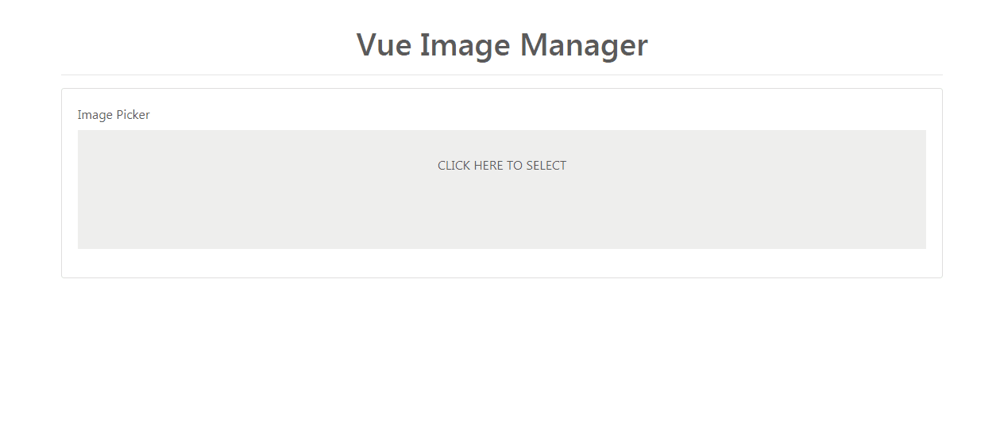

# Vue Image Manager



This is a vuejs plugin that lets you easily manage server side images.

## Install
```bash
yarn add vue-image-manager
```
or
```bash
npm i vue-image-manager --save
```

## Usage
In your main.js file, 
```javascript
import VueImageManager from 'vue-image-manager'
Vue.use(VueImageManager)
```
This will load the plugin and add the component.

In your component for file input,
```html
<form @submit.prevent="submit">
  <file-input v-model="files" :server="server" />
</form>
```
The v-model attribute binds the selected image from the server and provides the name and url of the image.

```javascript
export default {
  data() {
    return {
      files: {},
      server: {
        home: '/api/v1/file-picker/dir',
        add_folder: '/api/v1/file-picker/add_folder',
        file_uploads: '/api/v1/file-picker/upload_files'
      }
    }
  }
}
```
#### Server
The server object contains the server side urls for image management.

| Key | Description |
| --- |--- |
| home | This defines the endpont that returns the home folder. On execution, it receives a path parameter as a GET variable, eg, ``` { home: '/api/v1/file-picker/dir' } ``` , the request sent to the server is ``` /api/v1/file-picker/dir?path="" ``` . Blank path is home, ``` /api/v1/file-picker/dir?path="media/posts" ``` should be interpreted as the directory media/posts inside the home folder. |
| add_folder | This defines the endpoint that creates a folder in the durrent directory. It is sent as a POST request containing ``` { name: 'folder_name', path: '' } ``` . Path reffers to the relative path to create a folder inside the home directory. |
| file_uploads | This defines the file uploads handler in your server side. It is sent as a POST request that us multipart/form-data encoded containing ``` { path: '', uploaded_files: [ file1 ] } ``` . |

To select multiple images, add the attribute ``` :multiple="true" ``` to the element.